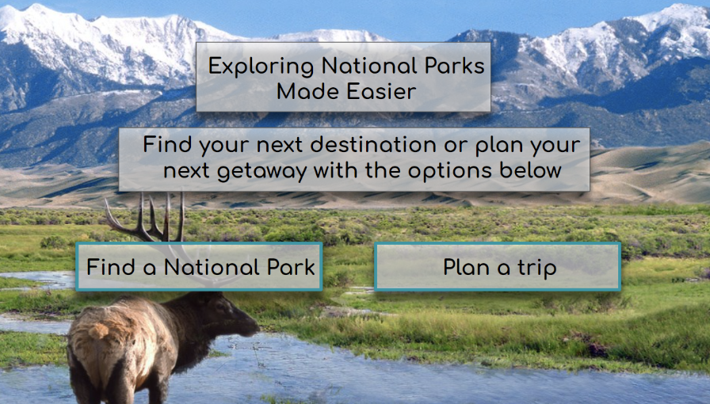

# Exploring National Parks
This is a web application intended to revolutionize how users interact with information from the National Parks Service, with a combined goal of increasing awareness of activities offered in the parks and helping individuals plan park visits. Users can use the application to learn more about national parks, or help inform their upcoming trips by using filters to find parks that contain activities within their interests.

# How to run
To see the current deployment, click [Here](https://exploring-national-parks-uqb1.vercel.app/).

To run on your local machine, go to the [How to Build](#how-to-build): 

### Project Board 
[https://github.com/orgs/cis3296f23/projects/117](https://github.com/orgs/cis3296f23/projects/117)
# How to contribute
Follow this project board to know the latest status of the project:[https://github.com/orgs/cis3296f23/projects/117](here)

### How to build
1. Clone this repository to your local machine
2. Download Node.js for your respective system, [Here](https://nodejs.org/en/download/current) 
3. Make sure npm and node are now on your local machine
    1. `npm -v`
    2. `node -v`
4. `cd exploring-national-parks `(the lowercase one)
5. `npm install` will install the necessary packages 
6. `npm start` will open the app in a new tab with a localhost server
